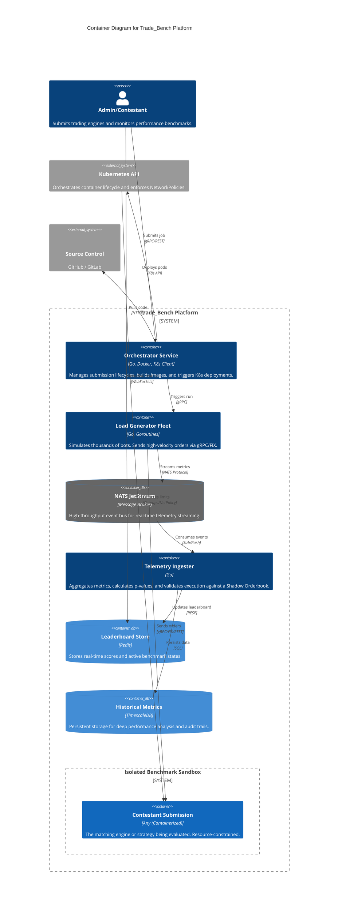
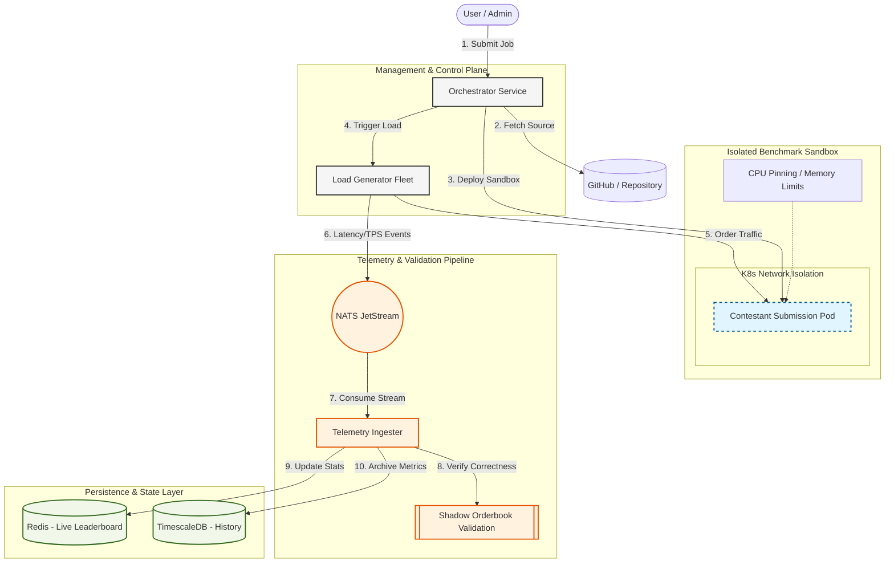

# Trade_Bench System Architecture

This document contains the primary architecture diagrams for the Trade_Bench platform, covering both high-level process flow and detailed engineering containers.

## 1. Engineering View (C4 Container Diagram)

The C4 diagram provides a detailed view of the microservices, their technology stacks, and the protocols used for inter-service communication.

---

## 2. Process View (Sequential Flowchart)

The flowchart illustrates the temporal sequence of events during a single benchmarking run.

---

### Component Legend

| Component | Responsibility | Technology |
| :--- | :--- | :--- |
| **Orchestrator** | Job management and K8s orchestration. | Go, K8s SDK |
| **Load Generator** | High-velocity bot simulation. | Go, Goroutines |
| **NATS JetStream** | Real-time event streaming backbone. | NATS |
| **Ingester** | Metric aggregation and validation. | Go |
| **Shadow Orderbook** | Reference implementation for fill accuracy. | Go (pkg/telemetry) |
| **Redis** | High-speed leaderboard storage. | Redis (RESP) |
| **TimescaleDB** | Historical performance telemetry. | PostgreSQL / Timescale |
